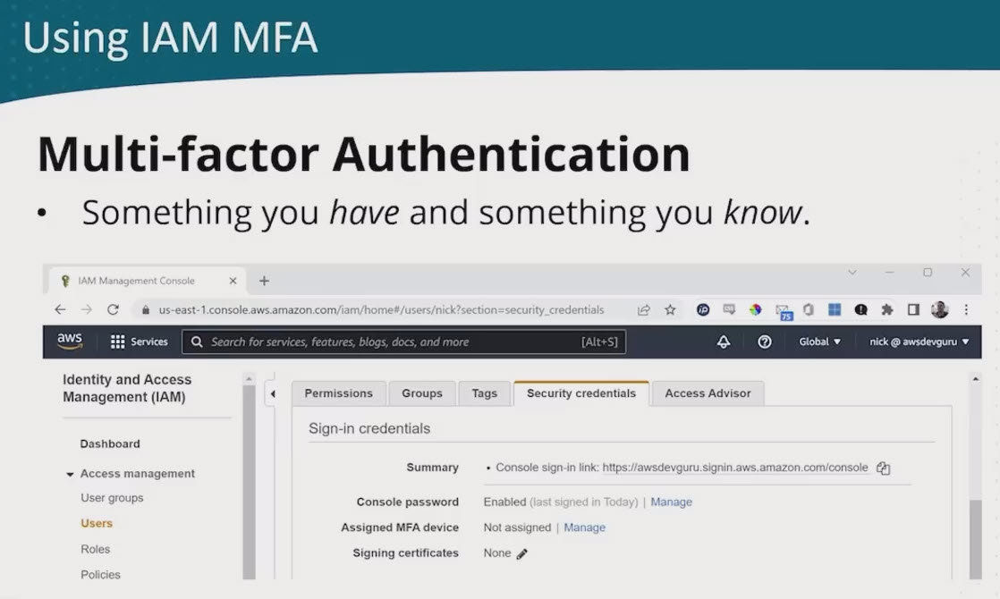
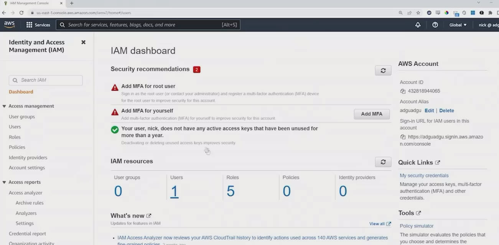
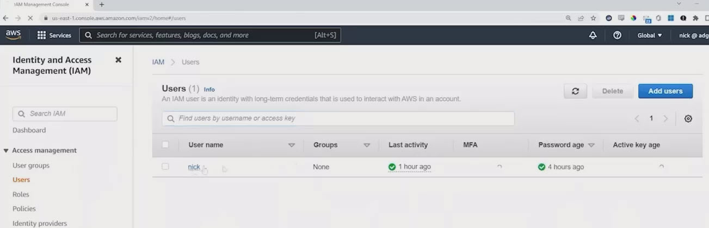
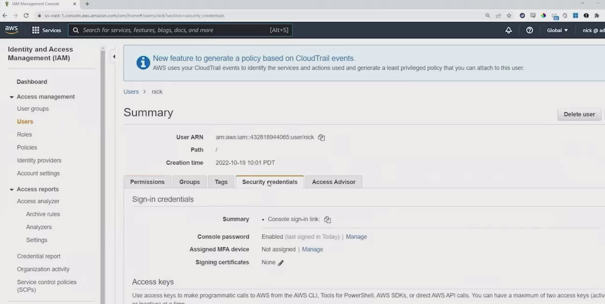
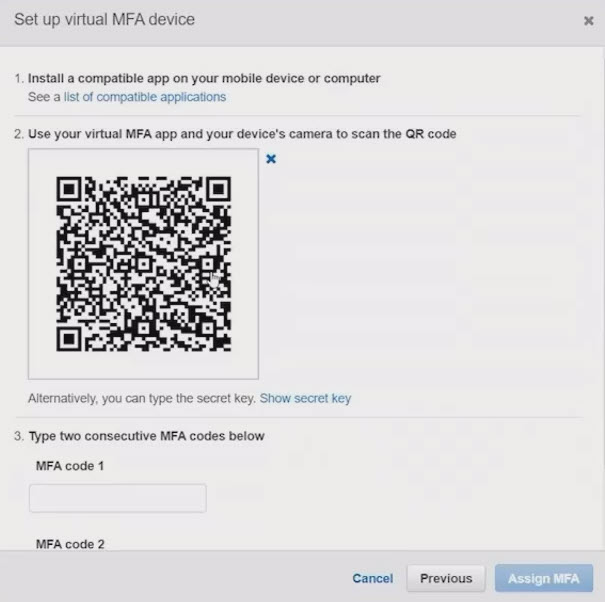
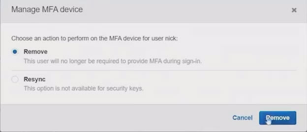

# 5.7 Using IAM multi-factor authentication (MFA) 
 
 # 🔐 What Is Multi-Factor Authentication (MFA)?
MFA enhances account security by requiring:

* **Something you know:** your password

* **Something you have:** a time-based token from a device

This two-step verification helps prevent unauthorized access even if a password is compromised.

# 📱 Types of MFA Devices

| Device Type           | Description                                         |
|------------------------|-----------------------------------------------------|
| Virtual MFA Device     | Smartphone apps like Google Authenticator, Twilio  |
| Hardware MFA Device    | Physical tokens (e.g., RSA, Gemalto)               |
| Other Authenticators   | Apps available for both Android and iOS            |

# 🧪 Demo Summary: Enabling MFA for IAM User

* 👤 User: GENERIC
No MFA initially assigned

* Used Google Authenticator on Android

### 🔧 Setup Steps
1. Open IAM → User → Security Credentials
   

2. Choose “Assign MFA device” → Select “Virtual MFA”

3. Scan the **QR code** using the app
   

4. Enter **two consecutive 6-digit codes** to complete enrollment

### ✅ Authentication Test
* Logged in via AWS Console with username and password

* Prompted for MFA code

* Successfully authenticated using rotating token from the app

### 🔄 Disable MFA
* Can be removed anytime via “Manage” → “Remove”

### 🧠 Key Takeaways
* MFA adds a critical layer of security to AWS accounts

* Virtual MFA is easy to set up and widely supported

* Physical presence may be needed for initial setup (to scan QR code)

* MFA can be enabled or disabled per user as needed
  
 
 ## [Context](./../context.md)