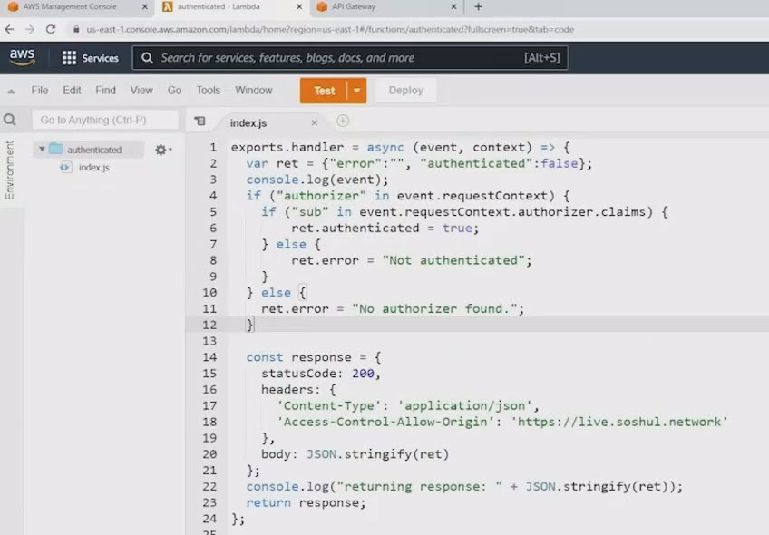
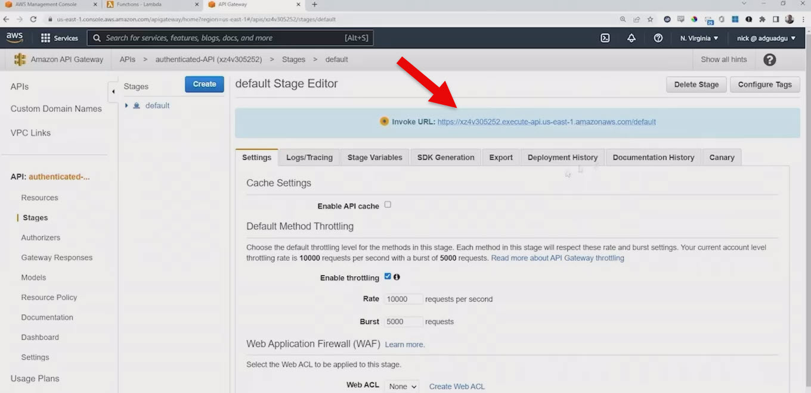
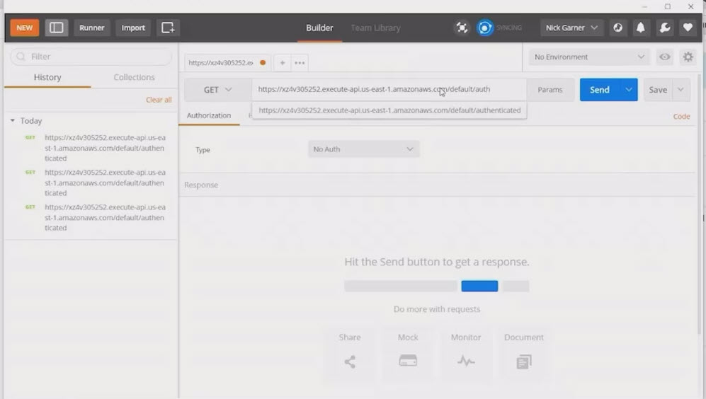

# 5.8 Creating a Cognito user pool 

Amazon Cognito is a powerful identity management service from AWS that helps you add user authentication, authorization, and user management to your web and mobile apps. Here's a breakdown of what it does and why it's useful:

## 🧠 Core Features of Amazon Cognito
* **User Pools** : A user directory that lets you manage sign-up and sign-in for your app. You can:

    - Authenticate users with username/password, phone/email, or social logins (Google, Facebook, etc.)

    - Handle multi-factor authentication (MFA)

    - Customize workflows with Lambda triggers

* **Identity Pools (Federated Identities)**: These allow users—authenticated or even anonymous—to access AWS services like S3 or DynamoDB using temporary credentials. You can:

    - Link identities from user pools or external identity providers

    - Control access to AWS resources with fine-grained permissions

* **OAuth 2.0 & OpenID Connect Support** : Cognito integrates with modern authentication protocols, making it easy to plug into existing systems or third-party identity providers.

* **Security & Scalability** : Cognito handles token issuance, encryption, and secure storage of credentials, and scales automatically with your app.

## 🔧 Use Cases
* Building a login system for your app

* Enabling social sign-in (Google, Facebook, Apple)

* Managing user sessions and access tokens

* Controlling access to AWS resources based on user identity

 
 # 🧩 Lesson Overview: Cognito User Pool + API Gateway Authorizer
**Goal:**
Demonstrate how to create a Cognito user pool and configure it as an authorizer for an API Gateway endpoint that triggers a Lambda function.

# 🛠️ Setup Components
* **Lambda Function:** Pre-deployed using a Hello World blueprint

* **API Gateway:** Pre-configured with a resource **/authenticated** and a **ANY** method using Lambda proxy integration

* **Postman:** Used to send HTTP requests to the API endpoint

# 🧪 Initial Test
* Sent request to API Gateway

* Lambda returned: **"No authorizer found"**     
➡️ Indicates no Cognito authorizer is yet configured

# 🔐 Cognito User Pool Creation
1. **Sign-in Option:** Email

2. **Password Policy:** Custom (lowercase + number)

3. **MFA:** Disabled

4. **Account Recovery:** Enabled (via email)

5. **Required Attributes:** Added **name**

6. **Email Delivery:** Via Cognito (not SES)

7. **User Pool Name:** ADGUUserPool

8. **Hosted UI Domain:** adguadgu.auth.us-east-1.amazoncognito.com

9. **App Client:**

    - Name: ADGUAppClient

    - No client secret

    - Callback URL: example.com

    - OAuth Flow: **Implicit Grant** (used for demo speed; not recommended for production)

# 👤 User Creation
* Created user: generic@awsdev.guru

* No invitation sent (manual sign-up)

# 🔄 Next Steps (Implied)
* Create Cognito authorizer in API Gateway

* Associate it with the /authenticated method

* Authenticate user via hosted UI

* Validate Lambda receives authorizer context and returns authenticated response

# 🧠 Key Takeaways
* Cognito user pools manage user identities and authentication flows

* API Gateway can use Cognito as an authorizer to secure endpoints

* Lambda functions can inspect **event.requestContext.authorizer** to determine authentication status
  
* Implicit grant is quick for demos but insecure for production (token exposed in URL)

# 🔐 Cognito User Pool Authentication Flow
**Objective:** 
Complete the Cognito user pool setup, authenticate a user via the hosted UI, and configure API Gateway to use Cognito as an authorizer for Lambda-backed endpoints.

# 👤 User Setup & Hosted UI
* **User Created:** adgu@awsdev.guru

* **Email Verified:** Checked during creation

* **Force Password Change:** Enabled

* **Password Change:** Done via hosted UI (same password reused)

* **User Attributes:** Name set to NickADGU

# 🌐 Hosted UI & Token Retrieval
* Accessed the **Hosted UI** in incognito mode

* Initially received an **authorization code** (requires exchange for token)

* Switched to implicit grant by changing **response_type=code** to **response_type=token**

* Logged in again and extracted the **ID token** from the URL fragment (after #)

* This token is used as a bearer token for API Gateway authorization

# 🔄 API Gateway Authorizer Setup
1. **Created Cognito Authorizer:** ADGUAuthorizer

2. **Linked to User Pool:** ADGUUserPool

3. **Token Source:** Custom header name (must match in HTTP request)

4. **Attached Authorizer** to /authenticated resource's ANY method

5. **Deployed API** to default stage

6. **Waited for propagation (~15–20 seconds)**

# 🧪 Testing Authorization
* **Initial Request:** Still showed "No authorizer found"

* **After Deployment:** Returned "Unauthorized"

* **Added Authorization Header** in Postman with the ID token

* **Final Request:** Returned "authenticated": true — success!

# 📊 Lambda Logs & Event Data
* Viewed logs in **CloudWatch**

* Found new log stream after sending requests

* **Event Data** now included:

    - **authorization** header

    - **requestContext.authorizer** object with:

        - User’s name

        - Email

        - Other attributes from Cognito

# 🧠 Key Concepts Recap

| Component           | Role                                                              |
|---------------------|--------------------------------------------------------------------|
| Cognito User Pool   | Manages user identities and authentication                         |
| Hosted UI           | Provides login interface and token retrieval                       |
| ID Token            | Used to authenticate requests to API Gateway                       |
| API Gateway         | Secures endpoints using Cognito authorizer                         |
| Lambda Function     | Validates presence of authorizer data in request context           |
| CloudWatch Logs     | Displays request metadata and authentication results               |

# 🎨 Hosted UI Customization
* Default UI shown after login

* Can be customized via CSS and branding

* Supports user self-management and registration flows

 
 ## [Context](./../context.md)