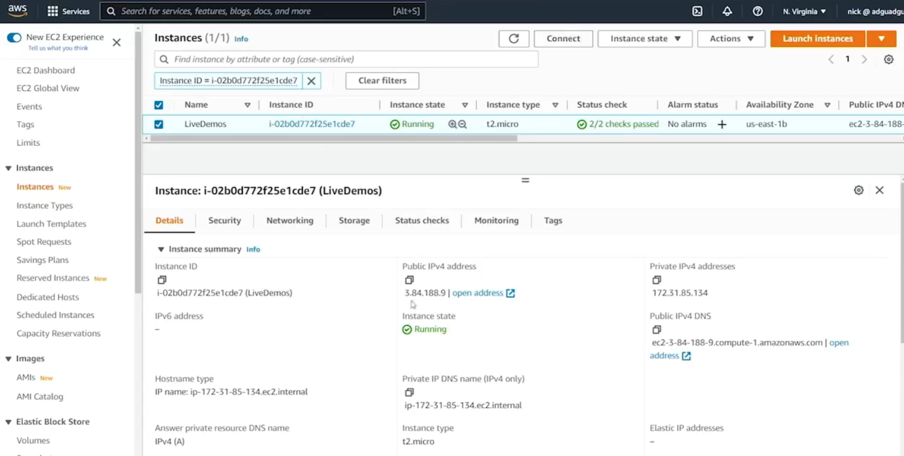
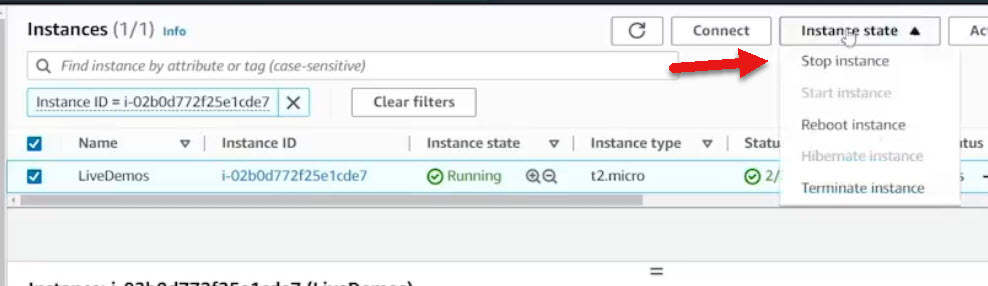

# 7.5 Understanding elastic IPs
 
# 🌐 Elastic IPs in AWS – Summary
### 📌 What Is an Elastic IP?
* A **publicly routable IPv4 address** that can be assigned to an EC2 instance.

* Unlike auto-assigned public IPs, **Elastic IPs persist** across instance stops and starts.

* Ideal for use in **DNS records** (e.g., myawesomewebsite.com → Elastic IP).



### 🔄 Why Elastic IPs Matter
#### ❌ Auto-Assigned IPs
* Public IP changes when an instance is stopped and restarted.

* Breaks DNS mappings unless manually updated.

### ✅ Elastic IPs
* Remain consistent across instance lifecycle.

* Enable stable DNS resolution and reliable external access.
  
  

### 🛠️ Demo Highlights
#### 🔧 Assigning an Elastic IP
1. Stopped EC2 instance → public IP was released.



2. Allocated Elastic IP from Amazon’s pool.

3. Associated Elastic IP with the instance.

4. Verified persistence across stop/start cycles.

### 💡 Metadata API Check
Used the instance metadata endpoint to confirm public IP:

``` bash
curl http://169.254.169.254/latest/meta-data/public-ipv4
``` 

### 💰 Elastic IP Pricing
|Condition	|Cost Impact|
|------------|-------------|
 **Associated with instance** |	✅ Free|
| **Unassociated (idle)** |💸 Charged hourly|

⚠️ Avoid hoarding unused Elastic IPs—they incur charges and are limited per region.

### 📈 Elastic IP Limits
* Default limit: **5 per region**

* To increase:

    - Go to **Limits → EC2-VPC Elastic IPs**

    - Submit a **support case** with justification

    - New accounts may be denied until aged

### 🧹 Cleanup
* Released unused Elastic IPs to avoid charges.

* Retained only the one actively associated with the demo instance.

### ✅ Final Verification
* Restarted instance → Elastic IP remained unchanged.

* Successfully reconnected using saved profile.

* Confirmed IP via metadata and curl. 
 
 ## [Context](./../context.md)