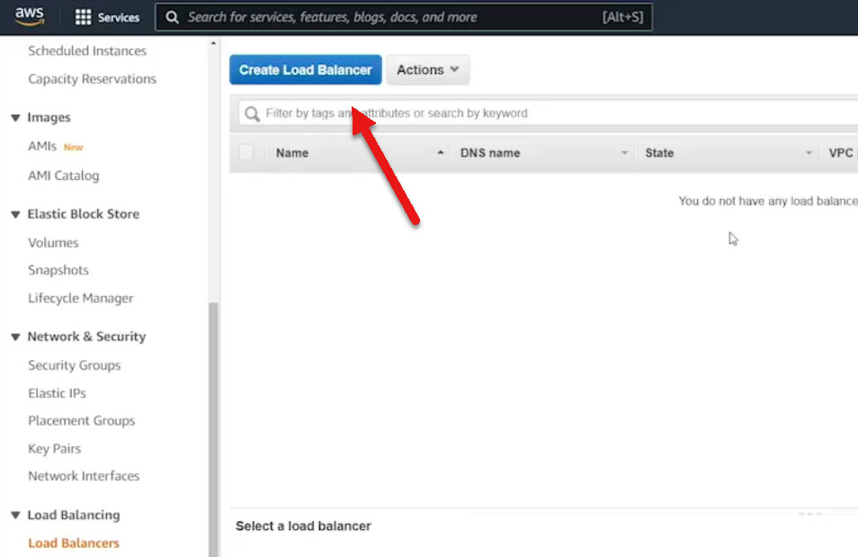
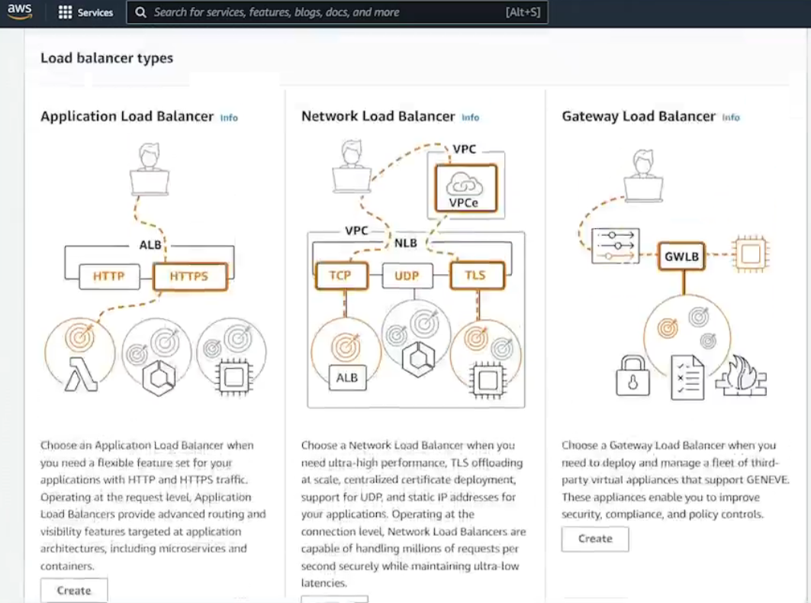
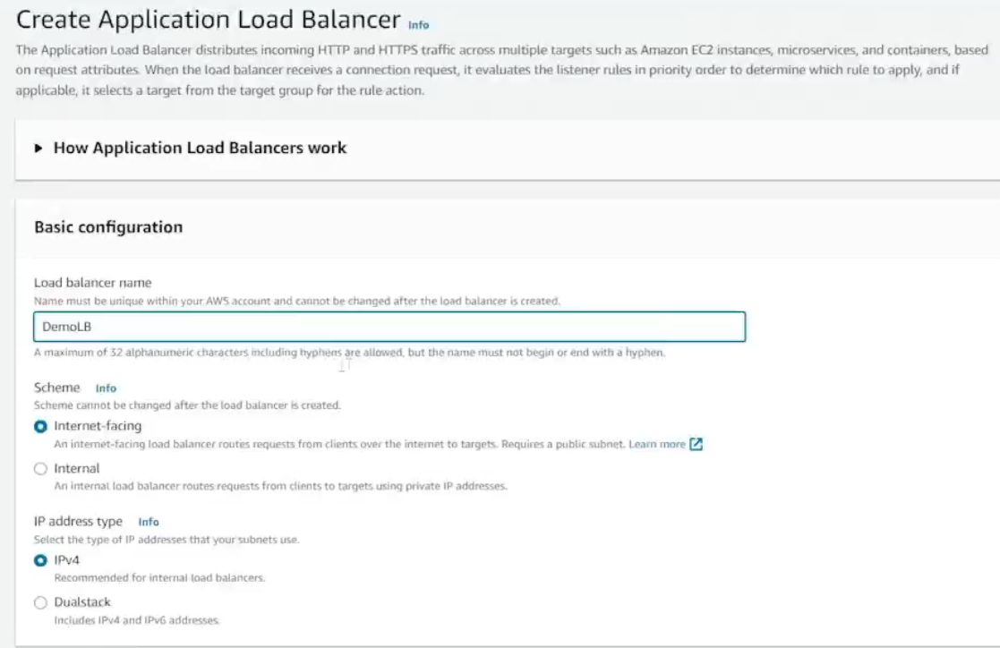
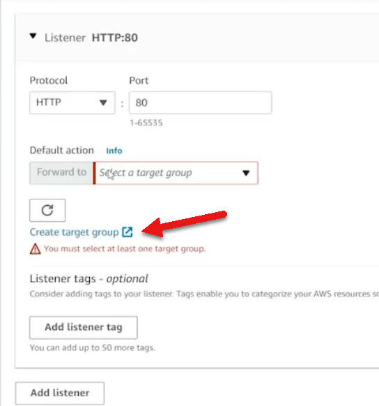

# 7.6 Using load balancers 
 
### ⚖️ Elastic Load Balancers (ELB) in AWS – Summary
#### 📌 What Is an ELB?
* A **feature of EC2** that distributes incoming traffic across multiple instances.

* Prevents any single server from being overwhelmed.

* Supports **Application Load Balancer (ALB)** for HTTP/HTTPS traffic with advanced routing and TLS termination.

### 🧪 Demo Overview
#### 🖥️ Setup
* Two EC2 instances **(httpserver1, httpserver2)** running Apache on Ubuntu.

* Each serves a simple index page with plain text:

    - **httpserver1 → "This is httpserver1"**

    - **httpserver2 → "This is httpserver2"**

#### 🔗 Load Balancer Creation

1. Created an **Application Load Balancer** named **demolb**.

2. Selected **internet-facing**, IPv4, mapped to a VPC.

3. Chose **availability zones** (1A and 1B) matching instance locations.

4. Assigned a **security group** allowing HTTP traffic on port 80.

# 🔁 What Is an EC2 Target Group?
A **Target Group** is a logical collection of resources—typically EC2 instances—that receive traffic from a Load Balancer (like an Application Load Balancer or Network Load Balancer).

## 🧩 Key Functions
* **Traffic Routing:** Load balancers forward requests to registered targets (EC2 instances) in the group.

* **Health Checks:** Target groups monitor the health of each instance and only route traffic to healthy ones.

* **Protocol & Port Configuration:** You define how traffic is sent (e.g., HTTP on port 80).

* **Multiple Target Types:** Can include EC2 instances, IP addresses, or Lambda functions.

## ⚙️ Use Cases
* Distribute traffic across multiple EC2 instances for scalability and fault tolerance.

* Separate traffic by application layer (e.g., one target group for frontend, another for backend).

* Integrate with Auto Scaling groups to dynamically adjust capacity.

## 🛠 Example Setup Steps
1. Open EC2 Console → Load Balancing → Target Groups

2. Create Target Group

    - Target type: EC2 Instances

    - Protocol: HTTP or HTTPS

    - Port: 80 or 443

    - VPC: Select your VPC

3. Configure Health Checks

    - Protocol: HTTP

    - Path: e.g., /health

4. Register Targets

* Select EC2 instances to include

5. Associate with Load Balancer

* Link the target group to a listener rule

### 🎯 Target Group Configuration

When creating a Load Balancer, you must configure a Listener to select the Target Group.

* Created target group demolbtg:

    - Protocol: HTTP

    - Port: 80

    - Health check path: /index.html

    - Success code: 200

    - Health check interval: 30s

    - Healthy threshold: 5, Unhealthy threshold: 2

* Added both EC2 instances to the target group.

### ✅ Load Balancer Behavior
* Once active, the load balancer DNS name served traffic.

* Verified **round-robin distribution:**

    - Refreshing alternated responses between server 1 and server 2.

### 🌐 Route 53 Alias Setup
🔄 Why Use Alias Records?
* ELB IPs may change over time.

* Alias records in Route 53 dynamically resolve to the current IPs of the ELB.

#### 🛠️ Steps
1. Open hosted zone (myexample.com) in Route 53.

2. Create a record:

    - Name: www.myexample.com

    - Type: A (Alias)

    - Alias target: demolb (Application Load Balancer in US East 1)
3. Result: DNS queries to www.myexample.com resolve to ELB’s current IPs.

### 📊 ELB IP Redundancy
* ELB returns **multiple public IPs** for redundancy.

* Route 53 alias record ensures consistent resolution even if ELB IPs change.

### 💡 Key Takeaways
|Feature|	Benefit|
|-------|----------|
| **ELB** |Distributes traffic across multiple servers|
| **Target Group** |	Manages backend instances and health checks
| **Route 53 Alias Record** |Ensures DNS stability despite IP changes|
| **TLS Termination** |Offloads encryption from backend servers |
 
 ## [Context](./../context.md)