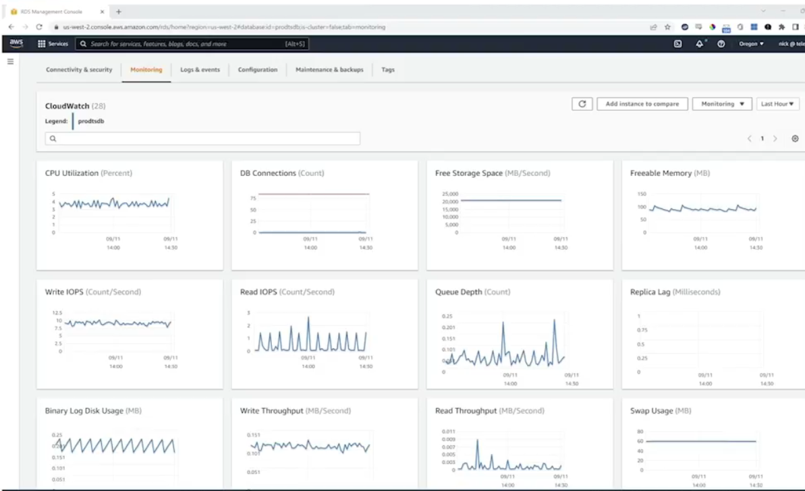
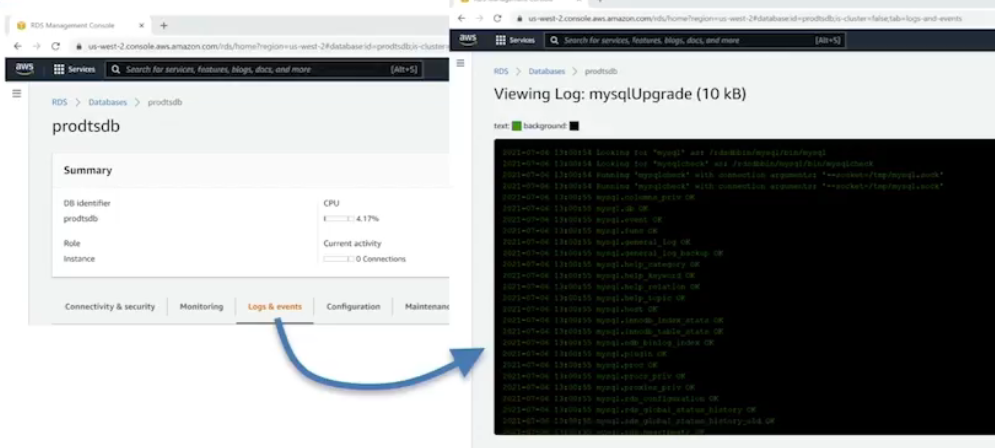

# 8.3 An RDS overview 

# Lesson Outline: Amazon Relational Database Service (RDS) and Elastic Compute Cloud (EC2) Database Deployment
## 🧩 Introduction to Amazon RDS
* RDS as a Software-as-a-Service (SaaS) offering

* AWS handles installation, OS, server infrastructure, and maintenance

## 🛠 Provisioning and Access
* User requests a database; AWS provisions and installs it

* Access via fully qualified host name using standard database clients

## 🔧 Management and Automation
* AWS manages updates, backups, read replicas, and failover

* Configuration and pricing depend on selected options

## 🗃 Supported Database Engines

| Engine               | Free Tier Eligible     | Key Features                                                                 | Edition                              |
|----------------------|------------------------|------------------------------------------------------------------------------|---------------------------------------|
| Amazon Aurora        | ❌                     | High performance, 64 TB storage, 15 read replicas, fast failover            | MySQL or PostgreSQL Compliant         |
| MySQL                | ✅                     | 6 TB max size, 32 vCPUs, automated backups, cross-region replicas           | Standard Community Edition            |
| MariaDB              | ✅                     | MySQL-compatible, similar specs                                             | MariaDB Community Edition             |
| PostgreSQL           | ✅                     | Oracle-compatible, standard deployment                                      | Standard PostgreSQL                   |
| Oracle               | ❌                     | Multiple editions (Enterprise, SE1, SE2), CPU-based pricing                 | Oracle EE, SE, SE One, SE Two         |
| Microsoft SQL Server | ✅ (Express only)      | Editions include Express, Web, Standard, Enterprise                         | Express, Web, Server SE, Server EE    |

# AWS RDS pricing components based on usage

| Component         | Description                                                                 |
|------------------|-----------------------------------------------------------------------------|
| Instance Class    | E.g., micro, small, large, xlarge                                           |
| Running Time      | Based on instance-hour                                                      |
| Storage           | Per-GB per-month                                                            |
| I/O Requests/Month| Total number of storage I/O requests made in a billing cycle                |
| Backup Storage    | Storage used for automated backups and snapshots                            |
| Data Transfer     | Internet data transfer in and out of your DB instance                       |

https://aws.amazon.com/rds/pricing/

## 🧪 Deployment Options
* **Dev/Test:** Single AZ, no replicas, lower cost, no fault tolerance

* **Production:** Multi-AZ, automated failover, higher availability

## 📦 Storage and Scaling
* Specify storage at launch; can scale without downtime

* Auto-scaling available

## 🖥 Instance Classes
* Similar to EC2 (e.g., t2.micro)

* Free tier uses Dev/Test + t2.micro template

## 🔐 Connectivity and Security
* Attach to VPC for private access

* Public access optional

* Use security groups to control traffic
  
### Summarizing the RDS Configuration Highlights
| Configuration Area | Options Available                                      |
|--------------------|--------------------------------------------------------|
| VPC Attachment     | Supported                                              |
| Public Access      | Supported                                              |
| Security Group     | Customizable                                           |
| Authentication     | - Password - Password and IAM database authentication - Password and Kerberos authentication |

## 🔑 Authentication
* Database access: master username/password

* RDS service access: IAM roles and policies

## 🗓 Maintenance and Protection
* Automated backups and snapshot encryption

* Maintenance windows for minor upgrades

* Termination protection to prevent accidental deletion

## 📊 Monitoring and Logging
* Charts: CPU, I/O, disk usage, throughput

* Access to engine logs (e.g., MySQL upgrade logs)

### Monitoring

### Logging

 
 
 ## [Context](./../context.md)