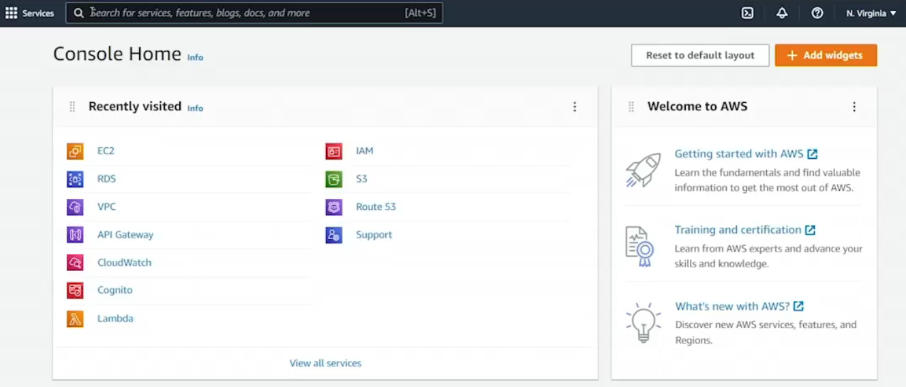
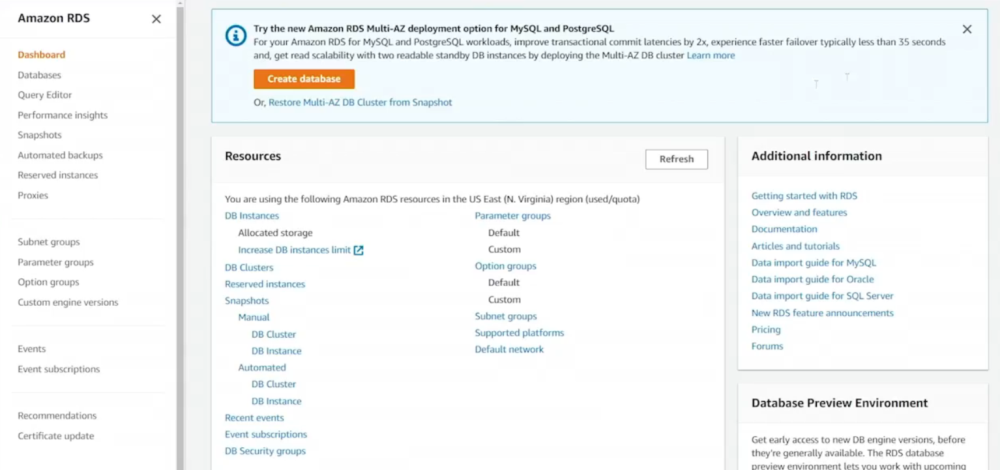
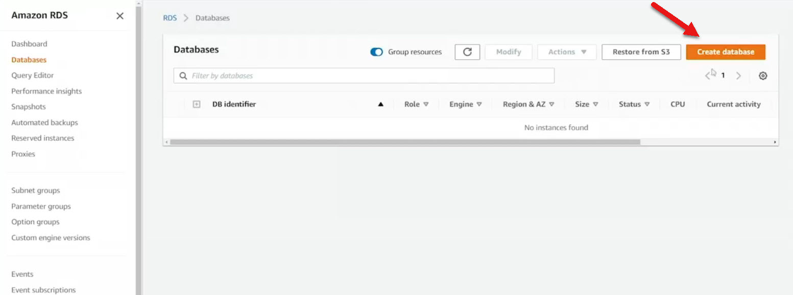
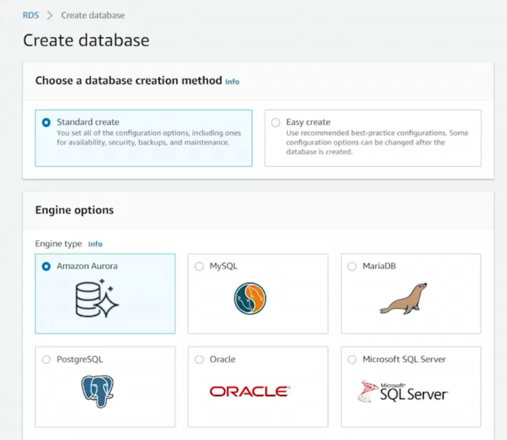
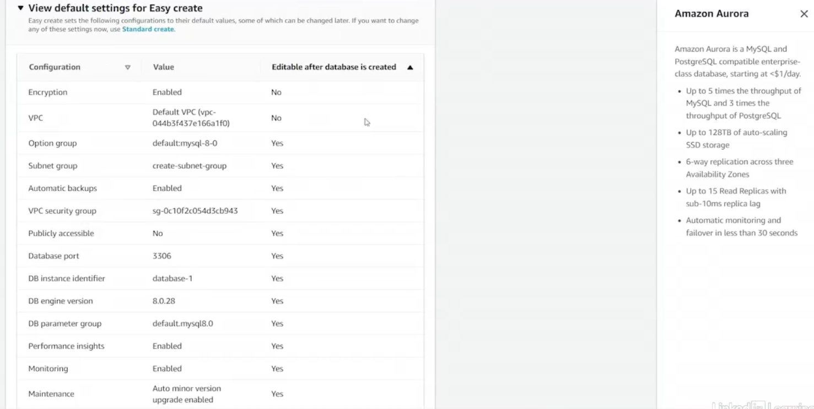
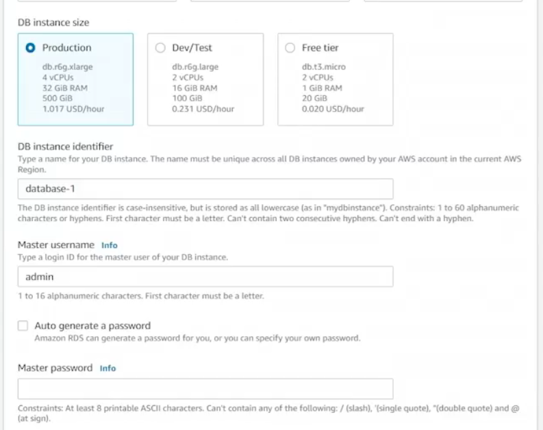

# 8.5 Configuring an RDS database 
 # 🧪 RDS MySQL Launch Demo – Outline
## 1. Region Selection & Cost Considerations
* **Regions used:** Northern Virginia & Ohio

* **Why not Oregon/N. California?:** Cost optimization

* **Free trial account:** Demonstration uses free tier to avoid charges

* **Reminder:** AWS services incur costs; region choice affects pricing
  
  

## 2. RDS Console Overview
* **Initial state:** 0/40 databases created

* **Switching regions:** Ohio has a pre-created instance for demo

* **Database creation time:** ~15–20 minutes

## 3. Database Creation Options
⚙️ Easy Create vs Standard Create

|Option	|Description	|Modifiable After Creation|
|-------|----------------|------------------------|
|Easy Create|	Simplified setup with defaults|	Limited (e.g., encryption, VPC, option group not modifiable)|
|Standard Create|	Full control over settings|	Most settings modifiable|

View default settings for Easy create

* Encryption and VPC settings cannot be modified after the database instance is created.

## 4. Pricing Tiers & Cost Breakdown
|Tier	|Hourly Rate|	Monthly Estimate|	Notes|
|-------|-----------|--------------------|-----------|
|Production|	$1.017/hr|	~$732/month|	High availability, managed setup|
|Free Tier|	$0.02/hr|	~$14/month|	Free for first year|
|Dev/Test|	$0.231/hr|	~$166/month|	Lower cost than production|

* **Cost justification:** Managed service vs hiring personnel for EC2-based MySQL

## 5. Configuration Parameters
* **Instance Identifier:** Custom name

* **Master Username/Password:** Manual or auto-generated

* **Client Access:** Via MySQL client using credentials

* **Advanced Settings (Standard Create):**

    - Instance type

    - IOPS

    - VPC & subnet group

    - Security group

    - Port (default: 3306)

    - Monitoring & maintenance

## 6. Post-Creation Observations
* **Ohio instance:** Created using Easy Create, MySQL, Free Tier

* **Status:** Available after ~20 minutes

* **Initial backup & configuration:** Automated by AWS

## 7. Security Group Bug
* **Issue:** Easy Create does not open port 3306 by default

* **Fix:** Manually add TCP port 3306 to security group

* **Impact:** Blocks access from EC2 instance unless corrected

## 8. Connectivity & Testing
* **EC2 Instance:** DB test launched in same subnet (ECHO 151)

* **MySQL Client:** Installed on EC2 for testing

* **Connection:** Via RDS endpoint using admin credentials

* **Sample Query:** SELECT * FROM employees; from HR database
  

## 9. Sample Data Source
* **Credit:** Sample HR database from [sqltutorial.org](https://sqltutorial.org/)

## 10. Key Takeaways
* RDS simplifies database management (patching, backups, maintenance)

* Easy Create is fast but limited in configurability

* Always verify security group settings for connectivity

* Cost varies significantly by tier and region
 
 ## [Context](./../context.md)