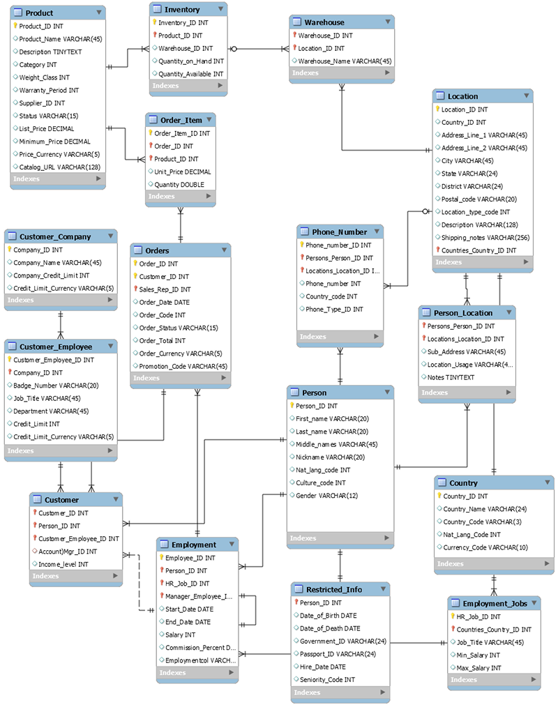

# 9.3 Exploring DDB data models 
 
 # Translating Relational Schema to DynamoDB: A Best Practice Highlight

## Overview

This document highlights a key example from the **DynamoDB Best Practice Guide** that demonstrates how to translate a relational database schema into a DynamoDB single-table design. Understanding this transformation is essential for developers moving from traditional RDBMS to NoSQL paradigms.

## Relational Schema Example

[Best practices for modeling relational data in DynamoDB](https://docs.aws.amazon.com/amazondynamodb/latest/developerguide/bp-relational-modeling.html)

In a typical relational setup, we might have the following tables:

- `Product`
- `Inventory`
- `Warehouse`
- `Location`
- `Category`

These tables are interconnected via foreign keys. For example:

- A `Location` points to a `Warehouse`
- A `Warehouse` is associated with a `Category`
- `Inventory` links `Product` and `Warehouse`

This normalized structure is ideal for relational databases but doesn't align with DynamoDB's design philosophy.

## DynamoDB Design Philosophy

Amazon DynamoDB encourages:

- **Single-table design**
- **Composite keys**: Partition Key (PK) and Sort Key (SK)
- **Denormalization**: Embedding related data together
- **Access pattern-driven modeling**

Instead of multiple tables, all entities are stored in one table, differentiated by their composite keys.

## Example Translation

The Best Practice Guide provides a visual example (refer to the Developer Guide for the image) showing how a complex relational schema is flattened into a single DynamoDB table.

### Composite Key Structure

[Example of modeling relational data in DynamoDB](https://docs.aws.amazon.com/amazondynamodb/latest/developerguide/bp-modeling-nosql-B.html)

Each item in the table uses:

- **PK (Partition Key)**: Groups related items
- **SK (Sort Key)**: Uniquely identifies the item within the group

### Sample Item Breakdown

For an HR employee record, the item might look like:

| PK           | SK               | Attributes                          |
|--------------|------------------|-------------------------------------|
| `HR#EMPLOYEE1` | `QUOTA`          | `HR-CONFIDENTIAL`, `Washington`, `SEATTLE`, `Desk Location`, `EmployeeName` |

This structure allows:

- Efficient querying by employee
- Logical grouping of related data (e.g., quotas, locations, metadata)
- Scalability and performance optimization

## Why This Matters

This example is a cornerstone for understanding:

- The **shift from normalized to denormalized** data modeling
- How **access patterns** drive schema design in DynamoDB
- The power of **composite keys** to simulate relational joins

## Recommendation

To deepen your understanding:

- Visit the [DynamoDB Developer Guide](https://docs.aws.amazon.com/amazondynamodb/latest/developerguide/best-practices.html)
- Review the **Modeling Relational Data in DynamoDB** section
- Study the example image and key structure breakdown

This documentation is invaluable for grasping how to effectively model complex relational data in DynamoDB using best practices.

---
*Topic: DynamoDB Schema Translation*

 
 ## [Context](./../context.md)