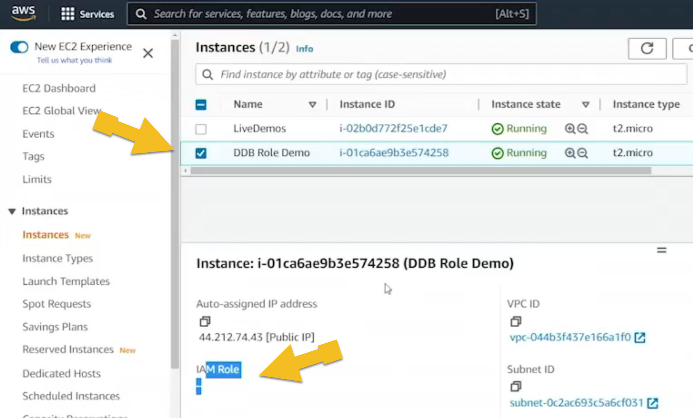

# 9.4 Securing DynamoDB 
 
 # IAM Role-Based Access to DynamoDB from EC2

## Overview
This document demonstrates how to use AWS IAM roles to control access to DynamoDB from an EC2 instance. The goal is to enable secure, credential-free interaction between an EC2-hosted Python application and DynamoDB using IAM roles.



---

## Prerequisites
- AWS account with permissions to manage IAM, EC2, and DynamoDB
- EC2 instance launched in **us-east-1** (Northern Virginia)
- Python environment with `boto3` installed
- Cloned repository containing:
  - `createtable.py`
  - `loaddata.py`
  - `scantable.py`
  - `config.json` (initially set to `us-east-2`, updated to `us-east-1`)

---

## Step-by-Step Guide

[DynamoDB/5_RoleDemo](./../CODE/DynamoDB/5_RoleDemo/)

### 1. Launch EC2 Instance
- Name: `DDB Role Demo`
- Region: `us-east-1`
- No IAM role attached initially

### 2. Prepare the Environment
```bash
pip3 install boto3
```
### 3. Attempt Table Creation Without IAM Role
```bash
python3 createtable.py
```
 * Error: Unable to locate credentials


## IAM Role Setup
### 4. Create IAM Policy

* Name: `DDB_Role_Demo_Policy`
* Service: `DynamoDB`
* Actions:
    - `ListTables`
    - `CreateTable`
    - Initially missing: `DescribeTable`, `PutItem`, `Scan`

### 5. Create IAM Role

* Name: `DDB_Role_Demo_Role`
* Trusted Entity: `EC2`
* Attach `DDB_Role_Demo_Policy`

### 6. Attach Role to EC2 Instance

* Update instance to use `DDB_Role_Demo_Role`

## Testing Access
### 7. Run Table Creation Again

``` bash
python3 createtable.py
```
* Table created: `RoleTest`
* Error: Missing `DescribeTable` permission

### 8. Update Policy

* Add `DescribeTable` action
* Retry table creation

## Load Data
### 9. Run Data Load
```bash
python3 loaddata.py
```
Error: Missing `PutItem` permission

### 10. Update Policy

* Add `PutItem` action
* Retry data load
* Partial success due to low provisioned throughput
  
## Scan Table

### 11. Run Scan
``` bash
python3 scantable.py
````
* Error: Missing `Scan` permission

### 12. Update Policy

* Add `Scan` and `Query` actions
* Retry scan
* Success: Found 38 items with `make = HONDA`
  
## Security Validation

### 13. Confirm No Credentials

* `config.json` only contains region
* No `.aws` directory
* No AWS environment variables
* Authentication is entirely via IAM role

## Final Verification

### 14. Full Workflow

```bash
python3 createtable.py
python3 loaddata.py
python3 scantable.py
````

* All operations succeed
* IAM role enables secure, credential-free access

## Conclusion

By applying a custom IAM role to an EC2 instance, we successfully:

* Created a DynamoDB table
* Loaded data into the table
* Scanned the table for specific items

This approach ensures developers can build applications without handling AWS credentials directly, improving security and maintainability.

 ## [Context](./../context.md)